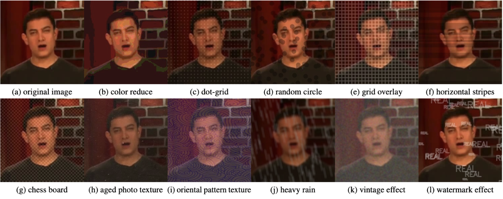

### Albutortion - Image Obfuscation Library
This library extends the Albumentations library by adding additional masking and noise effects inspired by techniques commonly used for obfuscation or noise injection. These effects can simulate various visual distortions, such as horizontal lines, circles, and stripes, making them useful for applications in data augmentation, privacy, and security research.

The library leverages OpenCV and Albumentations to create flexible, composable transformations for images.

#### Library Features
- Integration with OpenCV for advanced image processing capabilities.
- Extensive range of effects for realistic obfuscation simulations.
- Customizable transformations to fit various research needs.

### Installation Instructions

#### Prerequisites
Ensure you have Python 3.x installed on your system. You will also need pip for installing the packages.

#### Install Albumentations
First, you need to install the Albumentations library, which `Albutortion` extends:
```bash
pip install albumentations
```

## Description
This repository contains the source code for the `Albutortion` library, which extends the Albumentations library to include additional masking and noise effects for image obfuscation. It is designed for researchers and developers interested in data augmentation, privacy, and security research.

## Key Features
- Extends Albumentations with new obfuscation techniques.
- Flexible and customizable for various research and development needs.
- Includes example scripts and comprehensive documentation.




## Installation
For installation instructions, please see [installation.md](docs/installation.md).

## Usage
To learn how to use this library, please refer to the [usage.md](docs/usage.md) in the docs directory.


## Paper
This codebase accompanies the paper titled "Face detection and recognition under real-world scenarios  - dealing with deepfake incidents and malicious data distortions" by Ewelina Bartuzi-Trokieliewicz, Alicja Martinek, and Adrian Kordas. 

The paper discusses the challenges posed by deepfake technology and synthetic facial images to biometric verification systems and introduces a novel face detection method developed as part of this research.

### Read and Download the Paper
- **Read the Paper**: [face_detection_and_recognition_under_real_world_scenarios.pdf](papers/face_detection_and_recognition_under_real_world_scenarios.pdf) (PDF format)
- **Cite the Paper**: If you use this library or the research presented in the paper for your work, please cite it as follows:

```bibtex
@inproceedings{bartuzi2025face,
  title={Face Detection and Recognition under Real-World Scenarios: Dealing with Deepfake Incidents and Malicious Data Distortions},
  author={Bartuzi-Trokieliewicz, Ewelina and Martinek, Alicja and Kordas, Adrian},
  booktitle={Proceedings of the Winter Conference on Applications of Computer Vision (WACV)},
  year={2025},
}

